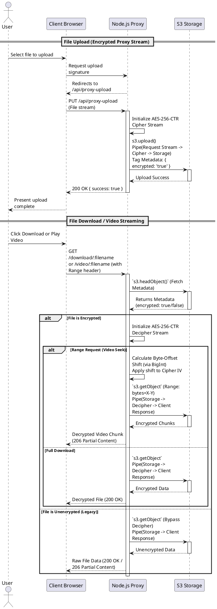

# Server-Side File Encryption System

## Overview
To protect user file privacy safely without negatively impacting upload and download speeds, we have implemented a transparent **Server-Side Streaming Encryption** system. Rather than relying on heavy client-side encryption that can freeze browsers or cause sluggish uploads, this solution leverages a high-performance Node.js proxy to encrypt and decrypt files on-the-fly as they are streamed to and from the storage backend (e.g., AWS S3 or Wasabi).

## Key Features
1. **Streaming Proxy Encryption (AES-256-CTR):** 
   Files are encrypted in real-time as the user uploads them. The application pipes the incoming data directly through an AES-256-CTR cipher stream straight into the S3 bucket without buffering the entire file into server memory or disk. This effectively maintains speeds almost identical to direct-to-S3 uploads.
   
2. **Zero Client Overhead:** 
   The browser uploads standard raw files seamlessly. No complex JavaScript ArrayBuffer manipulations or Web Crypto API overheads are required on the client side, ensuring rock-solid maximum upload speeds and minimal device resource usage.
   
3. **Seamless Video Seeking / Range Fetching:** 
   Because video streaming relies heavily on partial byte-range fetching (`Range: bytes=X-Y`), standard block ciphers like CBC cannot be easily used. We utilize a highly tailored **AES-CTR** implementation. By intelligently calculating block offsets using `BigInt`, the server can seek to any absolute random byte offset in an encrypted video file and initialize the CTR cipher securely at that exact position to seamlessly stream playback chunks.
   
4. **Backward Compatibility:** 
   Legacy unencrypted files naturally remain perfectly accessible. The system automatically tags newly encrypted files with unique S3 Object Metadata (`encrypted: "true"`). When a file is downloaded or streaming, the server performs a fast `HEAD` request to query this tag. Older files automatically bypass the decryption stream entirely, preventing playback errors or corrupted downloads.

## Architecture

Below is a detailed sequence diagram illustrating the internal workflows during File Upload and Download/Streaming.

